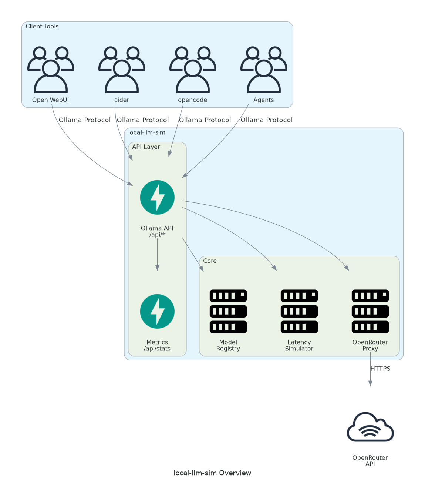
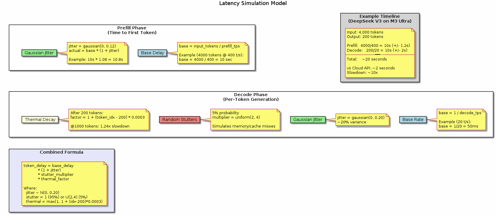
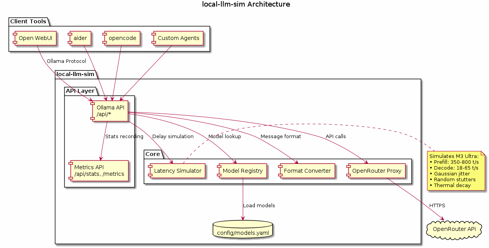
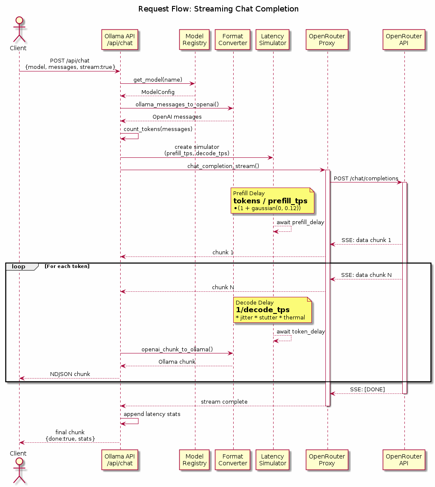

# Architecture: local-llm-sim

## Overview

local-llm-sim is a proxy server that emulates the Ollama API while adding realistic latency simulation to cloud LLM API calls. The goal is to let users experience what local LLM inference *feels like* on specific hardware before purchasing.

> **Disclaimer: Latency Data**
>
> The latency parameters used in this project (prefill/decode tokens per second) are **estimates** based on community benchmarks, published reviews, and theoretical calculations. They have not been validated on actual Mac Studio M3 Ultra hardware.
>
> Actual performance varies significantly based on:
> - Model quantization and format
> - Context length and batch size
> - System thermal conditions
> - Background processes and memory pressure
> - Specific mlx/llama.cpp versions
>
> We are actively collecting real-world benchmarks to improve accuracy. **Treat these numbers as approximate guidelines**, not guarantees. Contributions of verified benchmarks are welcome!

## Architecture Overview



The simulator sits between your tools and OpenRouter, adding realistic latency while preserving model quality.

## Design Goals

1. **Accurate latency feel** - Simulate prefill and decode speeds that match real hardware benchmarks
2. **Ecosystem compatibility** - Work with any Ollama-compatible tool (Open WebUI, aider, opencode, agents)
3. **Real model quality** - Use actual frontier models via OpenRouter, not degraded local versions
4. **Useful metrics** - Help users understand the time cost of local inference
5. **Benchmarking support** - Compare simulated local vs direct API performance side-by-side

## Non-Goals

1. **Exact hardware emulation** - We simulate latency, not memory limits, thermals, or OOM conditions
2. **Multiple hardware profiles (V1)** - Start with M3 Ultra only, add others later
3. **Offline operation** - Requires internet for OpenRouter
4. **Model fine-tuning** - Out of scope

## Key Design Decisions

### 1. Ollama API as Primary Interface

**Decision:** Implement the Ollama API rather than only OpenAI-compatible.

**Rationale:**
- Ollama is the dominant local LLM interface
- Open WebUI, aider, LangChain all have native Ollama support
- Model management (`pull`, `create`, `tags`) makes the experience realistic
- OpenAI compatibility can be added as a secondary interface at `/v1/*`

### 2. OpenRouter as Sole Backend

**Decision:** Use only OpenRouter, not multiple providers.

**Rationale:**
- OpenRouter aggregates most relevant models (DeepSeek, Llama, Qwen, Claude)
- Single API key, single billing
- Consistent API format simplifies the proxy
- Users can add any OpenRouter model via config
- Reduces scope significantly

**Trade-off:** Can't use provider-specific features or pricing. Acceptable for V1.

### 3. Stochastic Latency Model

**Decision:** Add realistic variance to delays, not just constant rates.

**Rationale:**
- Real inference has variance from memory access patterns, thermals, etc.
- Constant delays feel artificial and don't represent actual UX
- Occasional "stutters" are part of real local inference experience



**Latency Formula:**

```
Prefill delay:
  base = input_tokens / prefill_tps
  actual = base * (1 + N(0, 0.12))

Per-token decode delay:
  base = 1 / decode_tps
  jitter = N(0, 0.20)
  stutter = 1 (95%) or U(2, 4) (5%)
  thermal = 1 + max(0, (token_num - 200) * 0.0003)
  actual = base * (1 + jitter) * stutter * thermal
```

### 4. Model Variants for Benchmarking

**Decision:** Provide both `:m3` (simulated) and `:api` (passthrough) versions of each model.

**Rationale:**
- Users can directly compare simulated local inference with cloud API speeds
- Both use the same backend model for identical output quality
- Makes benchmarking workflow straightforward
- Clear naming shows what each model does

**Example:**
- `deepseek-v3:m3` - Simulates M3 Ultra speeds (400 t/s prefill, 20 t/s decode)
- `deepseek-v3:api` - Direct API access (no latency simulation)

### 5. Inline Latency Stats

**Decision:** Append simulation statistics to model responses.

**Rationale:**
- Users see latency breakdown directly in chat UI (Open WebUI)
- No need to check separate metrics endpoint
- Clear comparison of simulated vs actual API time
- Non-intrusive (appended at end of response)

**Example output:**
```
---
*M3 Ultra sim: 12.3s total (2.1s prefill @ 400 t/s, 10.2s decode @ 20 t/s) | API: 1.2s*
```

### 6. YAML Configuration Over Modelfiles

**Decision:** Use YAML for model configuration rather than Ollama Modelfile format.

**Rationale:**
- Modelfiles are designed for building actual models (FROM, ADAPTER, TEMPLATE)
- We're not building models, we're configuring proxies
- YAML is more readable and familiar
- Custom parameters (prefill_tps, decode_tps) don't fit Modelfile semantics

**Trade-off:** Not 100% Ollama compatible for `ollama create -f`. Acceptable because users are defining simulator configs, not real models.

### 7. DevContainer for Development

**Decision:** Use VS Code DevContainers instead of docker-compose for development.

**Rationale:**
- Single container with all tools pre-configured
- No docker-in-docker complexity
- Open WebUI runs natively via pipx alongside the simulator
- Reproducible development environment
- Simpler setup for contributors

### 8. Metrics Built-In

**Decision:** Include metrics collection and comparison from the start.

**Rationale:**
- The whole point is to understand latency impact
- Comparing simulated vs actual API time is the key insight
- Prometheus format enables dashboarding
- Cost tracking helps estimate cloud vs local trade-offs

## Detailed Architecture



## Component Details

### Latency Simulator

The latency simulator is the core differentiator. It operates in two phases:

**Prefill Phase:**
- Triggered before first token streams
- Duration based on input token count
- Blocks the response stream entirely during this phase
- Models the time for KV cache computation

**Decode Phase:**
- Applied to each token as it streams
- Calculates target emission time based on token index
- Sleeps if ahead of schedule, emits immediately if behind
- Handles backpressure gracefully

**Thermal Model:**
- After 200 tokens, each subsequent token is slightly slower
- Factor: 1 + (token_index - 200) * 0.0003
- At 1000 tokens: 1.24x slowdown
- Reset between requests (models cool-down)

### Model Registry

Models are defined in YAML and loaded at startup:

```yaml
models:
  deepseek-v3:m3:
    backend: deepseek/deepseek-chat-v3-0324
    display_name: "DeepSeek V3 [M3 Ultra]"
    latency:
      prefill_tps: 400
      decode_tps: 20
    capabilities:
      tools: true
      vision: false
      embeddings: false
```

Runtime operations:
- `GET /api/tags` - List all registered models
- `POST /api/show` - Get model details
- `POST /api/pull` - Register a model (validates backend exists)
- `DELETE /api/delete` - Unregister a model

### Format Conversion

Ollama and OpenAI/OpenRouter formats differ slightly:

**Chat Messages:**
```python
# Ollama format
{"role": "user", "content": "Hello", "images": ["base64..."]}

# OpenAI format
{"role": "user", "content": [
    {"type": "text", "text": "Hello"},
    {"type": "image_url", "image_url": {"url": "data:image/jpeg;base64,..."}}
]}
```

**Tool Calls:**
```python
# Ollama format (in response)
{"message": {"role": "assistant", "tool_calls": [...]}}

# OpenAI format
{"choices": [{"message": {"role": "assistant", "tool_calls": [...]}}]}
```

### Metrics Collection

Every request records:
- Timestamp
- Model name
- Input/output token counts
- Simulated prefill time
- Simulated decode time
- Backend (OpenRouter) response time
- Cost (from OpenRouter headers)

Aggregations:
- Total tokens processed
- Total simulated time vs backend time
- Per-model breakdowns
- Session cost

Exposed as:
- `/api/stats` - JSON summary
- `/metrics` - Prometheus format

## API Endpoints

### Ollama API (Primary)

| Endpoint | Method | Description |
|----------|--------|-------------|
| `/api/chat` | POST | Chat completion (streaming) |
| `/api/generate` | POST | Text completion (streaming) |
| `/api/tags` | GET | List models |
| `/api/show` | POST | Model details |
| `/api/pull` | POST | Register model |
| `/api/delete` | DELETE | Unregister model |
| `/api/embeddings` | POST | Generate embeddings (legacy) |
| `/api/embed` | POST | Generate embeddings (newer) |
| `/api/ps` | GET | Show "running" models |
| `/api/version` | GET | Ollama version (simulated) |

### Metrics

| Endpoint | Method | Description |
|----------|--------|-------------|
| `/api/stats` | GET | JSON statistics |
| `/api/stats/requests` | GET | Recent request log |
| `/api/stats/reset` | POST | Reset statistics |
| `/metrics` | GET | Prometheus format |

## Request Flow



1. Client sends Ollama-format request
2. Model registry looks up configuration
3. Messages converted to OpenAI format
4. Input tokens counted for prefill calculation
5. **Prefill delay** simulated (blocks until complete)
6. Request sent to OpenRouter
7. Stream received from OpenRouter
8. **Decode delay** applied per token
9. Chunks converted back to Ollama format
10. Latency stats appended to response
11. Response streamed to client

## Error Handling

**Backend errors:**
- Propagate OpenRouter errors with clear messaging
- Include original error in response for debugging
- Don't simulate latency on errors (fail fast)

**Model not found:**
- Return Ollama-compatible error format
- Suggest available models

**Rate limiting:**
- OpenRouter rate limits propagate through
- Add header indicating it's a backend limit

## Future Considerations

**V2 potential features:**
- Multiple hardware profiles (Strix Halo, RTX 5090, M4 Ultra)
- Vision/multimodal latency modeling
- Context-length dependent slowdowns (longer context = slower)
- Memory pressure simulation (queue requests when "full")
- Web dashboard for metrics
- Modelfile parsing for compatibility
- Multiple backend support (direct DeepSeek API, Together, etc.)

**Not planned:**
- Actual local inference (use Ollama for that)
- Model training/fine-tuning
- Caching/conversation memory (let clients handle)
